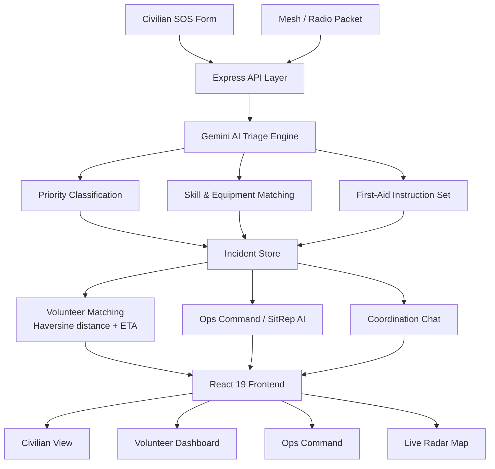

<div align="center">

# 🚨 ResQ AI

### Real-Time Disaster & Emergency Response Platform

**Report in seconds. Triaged by AI. Dispatched to the nearest verified responder.**

[](https://resqi-b52w.onrender.com)
[](https://react.dev)
[](https://www.typescriptlang.org)
[](https://ai.google.dev)
[](LICENSE)

### 🔗 [**Launch the Live Platform →**](https://resqi-b52w.onrender.com)

`https://resqi-b52w.onrender.com`

</div>

---

## 📌 Overview

**ResQ AI** is an emergency coordination platform that connects people in danger with vetted community volunteers during floods, fires, earthquakes, and other mass-casualty events.

When emergency lines are saturated and official services are overwhelmed, the bottleneck is rarely willingness to help — it's **triage and routing**. ResQ AI closes that gap: a civilian SOS is parsed by AI within seconds into a structured incident with a **priority level, hazard profile, required skills, equipment list, and immediate first-aid instructions**, then surfaced to the nearest qualified responder with a computed ETA.

The platform serves three roles from a single interface — **Civilians** raising SOS calls, **Volunteers** claiming and running missions, and **Dispatchers** commanding the overall operation — plus an **offline mesh/radio ingest path** for when the network itself is down.

> ⚠️ **Disclaimer:** ResQ AI is a coordination and decision-support tool, not a replacement for official emergency services. In a real emergency, always contact your national emergency number first.

---

## 🎯 The Problem

| Challenge | Consequence |
|---|---|
| Emergency lines saturate during mass events | Critical calls wait behind non-critical ones |
| Unstructured distress calls | Responders arrive without the right skills or equipment |
| No matching between need and capability | A medic gets sent to a flood extraction; a boat owner sits idle |
| Willing volunteers are uncoordinated | Duplicate effort in some sectors, zero coverage in others |
| Network and grid failures | Victims in dead zones become completely invisible |

---

## ✨ Core Capabilities

### 🆘 Civilian SOS with AI Triage
A single form captures location (GPS-assisted), people count (adults, children, injured, pets), hazards, and medical conditions. Gemini converts it into a structured incident with:

- **Priority classification** — `P1_CRITICAL` → `P2_HIGH` → `P3_MODERATE` → `P4_LOW`
- **Category** — Medical, Flood Rescue, Trapped, Fire Hazard, Food & Water, Evacuation, Special Care
- **Recommended responder skills** and **equipment manifest**
- **Immediate first-aid instructions** the victim can act on while waiting
- A concise **AI triage summary** for the dispatcher

### 🧑‍🚒 Volunteer Response Dashboard
Verified responders carry a profile with skills, certified badges, equipment, vehicle type, mission count, and rating. They claim incidents, update status through the lifecycle (`PENDING → DISPATCHED → EN_ROUTE → ON_SCENE → RESOLVED`), and are auto-released back to `AVAILABLE` on completion.

### 📍 Live Radar Map
Geospatial view of every active incident, responder position, and relief shelter — colour-coded by priority so the worst-hit sectors are visible instantly.

### 🎛️ Ops Command Centre
Dispatcher-level control with assignment authority, queue management, and **AI-generated Situation Reports** covering overall threat level, critical sectors, key bottlenecks, deployment status, and recommended actions.

### 💬 Incident Coordination Chat
A dedicated thread per incident linking victim, volunteer, dispatcher, and AI assistant — with urgent-message flagging and automatic system entries on state changes.

### 🏥 Shelter & Supply Management
Live registry of evacuation centres, medical stations, supply depots, and animal shelters — tracking capacity vs occupancy, medical staff presence, and stock levels (water, MRE packs, first-aid kits, blankets, generators). One-click evacuation updates occupancy and annotates the incident log.

### 🩹 AI First-Aid Guidance
On-demand, situation-specific first-aid instructions for bystanders holding the line until professional help arrives.

### 🤖 Disaster Copilot
A role-aware conversational assistant (Civilian / Volunteer / Dispatcher scope) that returns **actionable responses** — not just text. Replies can carry executable actions: navigate to a tab, open an incident, pre-fill an SOS form, claim a mission, or trigger the siren.

### 📻 Offline Mesh & Radio Ingest
When cellular and internet infrastructure fails, incidents can enter the system as compact VHF/packet-radio or SMS strings, decoded server-side into full incident records:

```
RESQ:P1|INC-8999|37.772,-122.42|FLOOD|2A 1C|Water at 2nd floor balcony
```

### 🔊 Acoustic Emergency Beacon
A Web Audio API siren synthesizer that turns any device into an audible locator for search teams working in low-visibility conditions, with no dependency on network availability.

---

## 🏗️ Architecture



**Flow:** SOS submitted → AI triage → incident created with priority → surfaced to matching volunteers → claimed → ETA computed by distance → coordination chat opens → resolved → responder released and mission logged.

---

## 🧰 Tech Stack

| Layer | Technology |
|---|---|
| **Frontend** | React 19, TypeScript, Vite 8, Tailwind CSS 4 |
| **UI / UX** | Lucide React icons, Motion (animations) |
| **Backend** | Node.js, Express 4, TypeScript (`tsx` / `esbuild`) |
| **AI** | Google Gemini via `@google/genai` |
| **Geolocation** | Browser Geolocation API + Haversine distance calculation |
| **Audio** | Web Audio API (emergency beacon synthesizer) |
| **Deployment** | Render (Node web service) |

---

## 🚀 Getting Started

### Prerequisites
- **Node.js 18+**
- A **Google Gemini API key** — [get one here](https://aistudio.google.com/apikey)

### Installation

```bash
# 1. Clone the repository
git clone https://github.com/sathi2305/RESQI.git
cd RESQI

# 2. Install dependencies
npm install

# 3. Configure environment
cp .env.example .env
# add your Gemini key to .env

# 4. Start the dev server
npm run dev
```

The app runs at **http://localhost:3000**

### Environment Variables

```env
GEMINI_API_KEY="your_gemini_api_key"
APP_URL="http://localhost:3000"
```

> 🔐 `.env` is gitignored — never commit API keys. Rotate immediately if one is ever exposed.

### Available Scripts

| Command | Description |
|---|---|
| `npm run dev` | Dev server with Vite middleware + HMR |
| `npm run build` | Build client (Vite) and bundle server (esbuild) |
| `npm start` | Run the production build |
| `npm run lint` | Type-check with `tsc --noEmit` |
| `npm run clean` | Remove build artifacts |

---

## 🔌 API Reference

**Base URL:** `https://resqi-b52w.onrender.com/api`

All responses follow a `{ success: boolean, ... }` envelope.

### Incidents
| Method | Endpoint | Description |
|---|---|---|
| `GET` | `/incidents` | List all incidents with live status |
| `POST` | `/incidents` | Submit an SOS — runs AI triage and returns the structured incident |
| `PATCH` | `/incidents/:id` | Update status, assign a volunteer, or append notes |
| `POST` | `/incidents/mesh-ingest` | Decode a radio/SMS packet into an incident |

### Volunteers
| Method | Endpoint | Description |
|---|---|---|
| `GET` | `/volunteers` | Roster with available and responding counts |
| `POST` | `/volunteers` | Register a new responder or update an existing profile |

### Shelters
| Method | Endpoint | Description |
|---|---|---|
| `GET` | `/shelters` | Shelter registry with capacity and supply levels |
| `POST` | `/shelters/:id/evacuate` | Record an evacuation and update occupancy |

### Coordination
| Method | Endpoint | Description |
|---|---|---|
| `GET` | `/incidents/:id/messages` | Fetch the incident chat thread |
| `POST` | `/incidents/:id/messages` | Post a message (supports urgent flag) |

### AI Services
| Method | Endpoint | Description |
|---|---|---|
| `POST` | `/ai/sitrep` | Generate a command-level situation report |
| `POST` | `/ai/firstaid` | Situation-specific first-aid guidance |
| `POST` | `/ai/project-chat` | Disaster Copilot with role scope and executable actions |

---

## 🗂️ Project Structure

```
RESQI/
├── server.ts                        # Express API, AI triage, matching engine
├── vite.config.ts                   # Vite + React + Tailwind config
├── index.html                       # App shell
├── .env.example                     # Environment template
└── src/
    ├── main.tsx                     # React entry point
    ├── App.tsx                      # Root state, polling, role routing
    ├── types.ts                     # Incident, Volunteer, Shelter, SitRep types
    ├── utils/audioBeacon.ts         # Web Audio emergency siren
    └── components/
        ├── Header.tsx               # Role switcher & global controls
        ├── CivilianSOSView.tsx      # SOS submission + live status
        ├── VolunteerDashboardView.tsx  # Mission queue & lifecycle
        ├── OpsCommandView.tsx       # Dispatcher command centre
        ├── LiveRadarMap.tsx         # Geospatial incident radar
        ├── DisasterCopilotChatbot.tsx  # Role-aware AI assistant
        ├── FirstAidAiModal.tsx      # AI first-aid guidance
        ├── OfflineMeshModal.tsx     # Radio packet ingest console
        └── ShelterEvacuateModal.tsx # Evacuation routing
```

---

## ☁️ Deployment

Deployed on **Render** as a Node web service.

| Setting | Value |
|---|---|
| **Environment** | Node |
| **Build Command** | `npm install && npm run build` |
| **Start Command** | `npm start` |
| **Environment Variables** | `GEMINI_API_KEY` (secret), `NODE_ENV=production` |

**Live URL:** https://resqi-b52w.onrender.com

> 💤 Free Render instances sleep when idle — the first request after inactivity may take 30–60 seconds to wake the service.

---

## 🗺️ Roadmap

- [ ] Persistent database (PostgreSQL) replacing in-memory state
- [ ] WebSocket push notifications in place of polling
- [ ] Volunteer identity verification and background-check workflow
- [ ] SMS gateway for SOS submission without internet access
- [ ] Offline-first PWA with background sync
- [ ] Multilingual SOS intake for regional deployment
- [ ] Integration hooks for official emergency-service dispatch systems
- [ ] Post-incident analytics and after-action reporting

---

## 🤝 Contributing

```bash
git checkout -b feature/your-feature-name
git commit -m "Add: clear description of your change"
git push origin feature/your-feature-name
# Open a Pull Request
```

Run `npm run lint` before submitting, keep PRs focused, and never include real personal or location data in examples or test fixtures.

---

## 📄 License

Distributed under the MIT License. See [`LICENSE`](LICENSE) for details.

---

## 👤 Author

**Sathiyamoorthi**

[](https://github.com/sathi2305)

---

<div align="center">

### ⭐ If this project helps you, consider starring the repository.

**[🚨 Try the Live Platform](https://resqi-b52w.onrender.com)**

*Every second saved is a life protected.*

</div>
